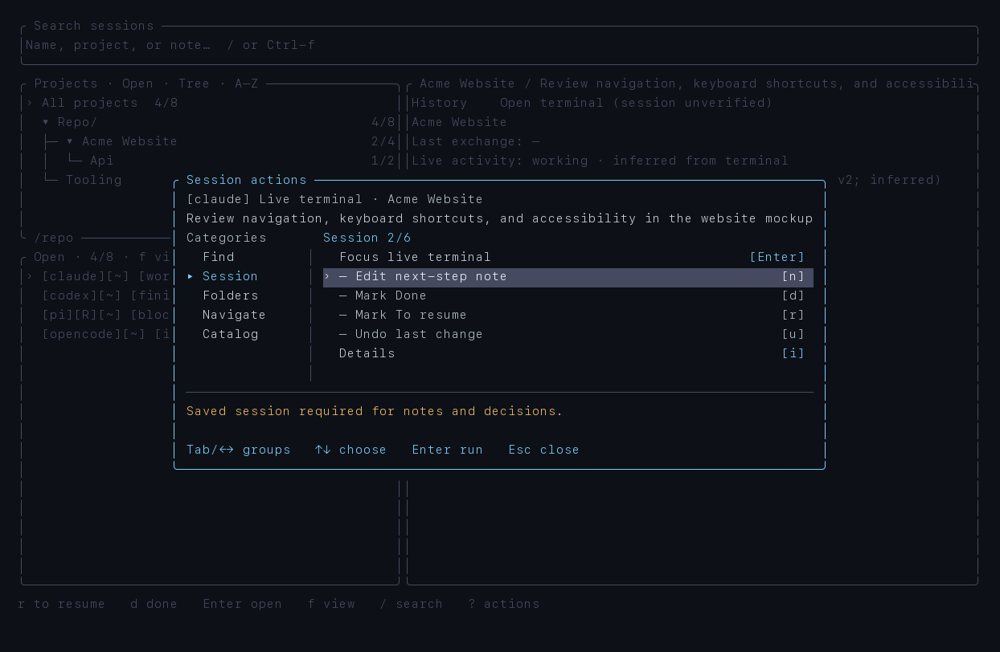

# tmux-agent-monitor

**Agent management in tmux. No extra platform.**

[](LICENSE)
[](https://www.rust-lang.org/)
[](#requirements)

A tmux-native monitor and session explorer for **Claude Code, Codex, OpenCode,
and Pi**. Track live agents, identify sessions that need attention, inspect
local conversation history, and resume work from a keyboard-driven Rust TUI
or a scriptable CLI.

Keep tmux in charge of terminals. Add visibility, not another runtime.


## Why this exists

`tmux-agent-monitor` started with a practical objection: **Herdr felt bloated
for an existing tmux workflow.** tmux already provides the terminal lifecycle,
panes, windows, and detach/attach semantics. We do not need a second platform
to own those terminals just to see which agents are working and recover a
conversation.

[Herdr](https://herdr.dev) takes a broader approach: its own background server,
terminal ownership, workspace/tab hierarchy, and agent automation. That scope
can be useful, but it adds architecture and operational overhead outside this
project's requirements.

**Herdr is also an inspiration.** Its
[documented agent detection](https://herdr.dev/docs/agents) demonstrates how
process identity and scoped terminal signals can expose useful live states.
This project independently implements that idea with local manifests and
explicit evidence, while leaving terminal management to tmux.

The boundary is deliberate:

- **Compose with tmux.** Observe existing panes; focus or resume only on request.
- **Keep the runtime local.** No additional server, telemetry, remote manifest
  updates, or runtime network requests.
- **Separate observation from decisions.** A finished agent turn is not a
  completed task. Notes and Done remain explicit user choices.
- **Expose ordinary commands.** Use the TUI interactively or query JSON from
  the CLI. No task-registration protocol or mandatory plugin.

## Capabilities

- **Automatic discovery:** derive projects and conversations from local agent
  histories, without manually registering tasks or workspaces.
- **Live activity:** show `working`, `finished`, `idle`, `blocked`, `waiting`,
  `error`, `unknown`, or `mixed`, with inspectable detection evidence.
- **Project navigation:** foldable folder tree, flat layout, alphabetical or
  latest-saved-update ordering, and project/session/text search.
- **Conversation inspection:** paginated previews, branch selection, optional
  tool output, and metadata-only project/session Details.
- **Explicit resume:** revalidate identity and cwd, then use provider-specific
  argv to focus an existing pane or create a resume window.
- **Durable work decisions:** History, To resume, Done, next-step notes, and undo
  in a private SQLite catalog, independent of transient terminal activity.

## Requirements

- macOS or Linux, with `tmux` and `ps` available.
- An interactive terminal for the TUI; query commands run headlessly.
- Rust **1.89+** for source builds. Agent CLIs are required only when resuming
  their sessions; the monitor does not install or configure them.

## Installation

### Homebrew

```sh
brew tap g-battaglia/tmux-agent-monitor
brew install --HEAD g-battaglia/tmux-agent-monitor/tmux-agent-monitor
tmux-agent-monitor
```

The [tap](https://github.com/g-battaglia/homebrew-tmux-agent-monitor) builds
`main` with the locked Rust dependencies and installs tmux as a runtime
dependency. The formula is **HEAD-only**, not a tagged release. It does not
install agent clients, extensions, or background services.

```sh
brew upgrade --fetch-HEAD g-battaglia/tmux-agent-monitor/tmux-agent-monitor
```

### Source

```sh
git clone https://github.com/g-battaglia/tmux-agent-monitor.git
cd tmux-agent-monitor
cargo build --release --locked
./target/release/tmux-agent-monitor
```

Or install the binary directly:

```sh
cargo install --git https://github.com/g-battaglia/tmux-agent-monitor.git --locked
```

## Supported histories

| Agent | Default local source | Explicit resume argv |
|---|---|---|
| Claude Code | `~/.claude/projects` — top-level JSONL | `claude --resume <id>` |
| Codex | `~/.codex/sessions` — rollout JSONL | `codex resume <id>` |
| OpenCode | `~/.local/share/opencode/opencode.db` — SQLite | `opencode --session <id>` |
| Pi | `~/.pi/agent/sessions` — JSONL v3 | `pi --session <file>` |

`CLAUDE_CONFIG_DIR`, `CODEX_HOME`, and `XDG_DATA_HOME` override the corresponding
locations. Pi supports custom roots, including project `.pi/settings.json`;
additional undeclared paths can be added with `sources add`. Codex titles also
use its local `session_index.jsonl`, without turning bootstrap instructions
into conversation names.

Live panes without a proven history association remain selectable **live
terminal** rows, not invented conversations. They can be focused, but cannot
carry durable notes or Done decisions. Duplicate identities are never resolved
by arbitrary association.

## TUI workflow

Startup is always **All projects / Open**. The current cwd and previous filters
do not silently narrow the catalog. Use `f` to choose All, To resume, Open, or
Done; selecting All projects clears project/session search and preserves the
current view. Open terminals remain at the top of All.

The three panels are **Projects**, **Sessions**, and **Preview**. Provider
badges, work decisions, presence, and activity are independent:

```text
[pi][R][O] [working]       verified opening; marked To resume
[claude][~] [finished]    probable opening; observed turn end
```

`[R]` means To resume; `[O]` means a verified Pi opening; `[~]` is a probable
association. Verification proves identity, not the inferred activity state.
Search for a provider or activity word to find matching session rows.

| Key | Action |
|---|---|
| `1/2/3`, `h/l`, `Tab` | Focus panels |
| `j/k`, arrows | Move or scroll |
| `Enter` | Select a project, focus a pane, or offer resume |
| `f` / `p` | Session view / project picker |
| `Space`, `←/→` in Projects | Fold or navigate a branch |
| `E` / `C` | Expand / collapse all, switching to Tree if needed |
| `v` / `s` | Tree/flat layout / alphabetical/recent ordering |
| `/`, `Ctrl-f`, search-bar click | Search the active panel |
| `r` / `d` | Mark To resume / Done |
| `n` / `u` | Edit next-step note / undo |
| `o` / `i` | Open panes / project or session Details |
| `z`, `[` / `]`, `b` / `t` | Expanded preview, pages, branches, tool output |
| `gg`, `G`, `Ctrl-d/u` | Ends / half-page scrolling |
| `R` | Refresh without changing scope |
| `?`, `Esc`, `q` | Action menu, back, quit the monitor only |

Ancestor folder groups remain navigable when their own sessions do not match
the active view. Enter folds a group; Details summarizes its descendants.
Recent ordering uses saved conversation updates, **not inferred activity**.
Search reveals matching projects without discarding folds. Layout, ordering,
and folds last for one run and do not modify notes or work decisions.

The action menu groups commands by category. `Tab` / `Shift-Tab` or `←/→`
changes category, `↑/↓` selects, and Enter executes. Direct shortcuts work
across categories; disabled actions remain readable and explain why they
cannot run. Narrow terminals use a compact category selector.



## CLI

```sh
tmux-agent-monitor sessions --open --json
tmux-agent-monitor sessions --all --project acme-website
tmux-agent-monitor show <id> --json
tmux-agent-monitor details <id>
tmux-agent-monitor details --project acme-website --json
tmux-agent-monitor details                         # catalog overview
tmux-agent-monitor pick --project acme-website

tmux-agent-monitor note <id> 'Review the timeout handling'
tmux-agent-monitor done <id>
tmux-agent-monitor reopen <id>
tmux-agent-monitor undo <id>
tmux-agent-monitor open <id> --resume

tmux-agent-monitor sync
tmux-agent-monitor sources list
tmux-agent-monitor sources add /path/to/sessions
```

`<id>` accepts native or catalog session ids; ambiguity is rejected.
`sessions --open --json` returns `{ "sessions": [...], "panes": [...] }`;
other session listings return arrays. Details reports metadata, not transcript
bodies. Query output can be consumed by `jq`, `fzf`, or your own tooling.

`open` focuses a verified opening when available. Starting an agent requires
confirmation or the explicit `--resume` flag. Identity, cwd, and presence are
rechecked before launch; probable or verified openings prevent accidental
duplicate resume attempts. Commands never inject keystrokes or answer
permissions on your behalf.

## Activity detection

A worker samples recognized agent panes approximately every two seconds,
including verified Pi openings. It reads the **current viewport**, not
scrollback, through bounded `tmux capture-pane -S 0` calls. Prioritized local
rules examine scoped bottom lines, title signals, and known permission UI.
Captured text is discarded after matching; only bounded identity keys,
fingerprints, and observation state are retained in memory.

| State | Interpretation |
|---|---|
| `working` | Recognized spinner, interrupt/status line, or title signal |
| `finished` | Observed working, then two stable idle samples at least 1.5s apart |
| `idle` | Ready/no recognized work; no completed turn was observed |
| `blocked` | Recognized permission/approval UI |
| `waiting` | Recognized interactive selection/question UI |
| `error` | Recognized API/request failure, not a generic tool error |
| `unknown` | No usable signal, unavailable capture, or empty screen without a signal |
| `mixed` | Multiple openings of the same conversation disagree |

**These are observations, not guarantees.** Finished means an inferred end of
an observed turn, not successful task completion and never automatic Done.
An agent already idle when monitoring begins stays idle. Process or verified
session-generation changes, missing panes, errors, and capture failures reset
completion inference. Unmatched known-agent output can fall back to idle;
Codex without a title signal can remain unknown.

Inspect rule provenance or watch transitions without opening the catalog:

```sh
tmux-agent-monitor agent explain %3 --json
tmux-agent-monitor agent explain %3 --watch --json       # JSON Lines until Ctrl-C
tmux-agent-monitor agent explain %3 --watch --samples 5
tmux-agent-monitor agent explain --file screen.txt --agent codex
```

One snapshot cannot establish a finished turn. `--watch` and the TUI can
because they keep observation history. The watcher stops if the selected
process identity changes.

Overrides live in `~/.config/tmux-agent-monitor/agent-detection/<agent>.toml`.
They support prioritized, scoped predicates; invalid/oversized files fall back
to bundled rules with a diagnostic warning. `finished` and `mixed` are derived
states, not snapshot-rule states. No manifests are fetched remotely.

For opaque sandbox wrappers, use a **per-command** hint, not a globally
exported variable:

```sh
TMUX_AGENT_MONITOR_AGENT=codex fence -- codex
```

## Optional Pi identity verification

Live detection works without plugins. Pi title/cwd matching provides probable
identity; the bundled metadata-only observer adds verified identity across
in-process session switches:

```sh
tmux-agent-monitor integration pi status
tmux-agent-monitor integration pi install
```

Install is explicit. Existing Pi sessions require a user-issued `/reload`;
the monitor never installs or reloads an extension automatically. A new
installation uses `tmux-agent-monitor-presence.ts`; an existing owned legacy
observer keeps its filename to avoid loading duplicates.

## Architecture and safety

Rust + Ratatui for the TUI; SQLite for the catalog; tmux for terminals.
Provider files remain the source of truth. Bounded incremental readers index
history and build previews; the worker performs filesystem/database/process
I/O and supplies cached snapshots to the UI. Rendering and navigation do not
perform blocking I/O. Detail requests are latest-wins; decision mutations are
ordered and acknowledged.

- **Read-only provider storage.** JSONL transcripts are not edited. OpenCode
  uses read-only/query-only SQLite and only session/message/part tables,
  never account or credential tables.
- **Private local state.** `sessions.db` uses owner-only storage: directory
  `0700`, database `0600`; unsafe symlinks and permissions are rejected.
- **Explicit terminal actions.** Discovery uses listing and capture commands.
  No `send-keys`, pane closure, tmux configuration edits, or implicit launches.
- **No runtime remote requests.** No telemetry, transcript uploads, credential
  reads, or remote detection manifests.
- **Safe display.** ANSI, control, and bidi-spoofing sequences are stripped.

### Rename compatibility

Previously named `agent-monitor`; the binary and Cargo package are now
`tmux-agent-monitor`. GitHub redirects preserve old repository links. The tap
also retains `agent-monitor` as a formula alias; the installed command uses
the new name.

Fresh state defaults to `~/.local/state/tmux-agent-monitor/sessions.db`.
An existing legacy `~/.local/state/agent-monitor` directory is reused unless
a canonical catalog already exists. **No databases are moved or deleted.**
Use `--data-dir` to select a directory explicitly, or set
`TMUX_AGENT_MONITOR_HOME`. The legacy `AGENT_MONITOR_HOME` alias remains valid;
the canonical environment variable takes precedence.

Canonical detection overrides take precedence, with legacy
`~/.config/agent-monitor/agent-detection` as a per-agent fallback.
`AGENT_MONITOR_AGENT` and `AGENT_MONITOR_TMUX_CLIENT` remain accepted aliases
for `TMUX_AGENT_MONITOR_AGENT` and `TMUX_AGENT_MONITOR_TMUX_CLIENT`.
Existing observers remain untouched until explicitly updated; for custom
roots, update/reload the observer before switching to the new environment
variable. Legacy `board.db` and `library.db` are never opened or migrated.

## Format and resource limits

- Pi JSONL v3, Claude top-level JSONL, Codex rollout JSONL, and OpenCode SQLite
  (`session`/`message`/`part` or `session_v2`/`session_message`) are supported.
  Unsupported formats are reported, not migrated. Claude subagent files and
  older OpenCode JSON-directory storage are excluded.
- JSONL: 512 MiB per file, 8 MiB per line, 100k preview entries. OpenCode:
  100 sessions per indexing batch, 64 MiB of message data per session.
  Partial previews are labeled.
- Unsaved sessions appear only while running and cannot be resumed from history.
  Screen inference can miss short turns or unfamiliar UI layouts.

## Development

```sh
cargo fmt --check
cargo test --locked
cargo clippy --all-targets --locked -- -D warnings
cargo build --release --locked
bun test integrations/pi
python3 scripts/smoke.py ./target/release/tmux-agent-monitor
cargo run --release --locked --example latency
python3 scripts/latency.py
python3 scripts/screenshot.py
python3 scripts/screenshot.py --menu
```

Tests use disposable data and stub executables; they never start real agents,
focus user panes, or close terminals. Screenshots are generated from synthetic
fixtures, not personal conversations. No CI workflows are included.

## License

MIT. See [LICENSE](LICENSE).
