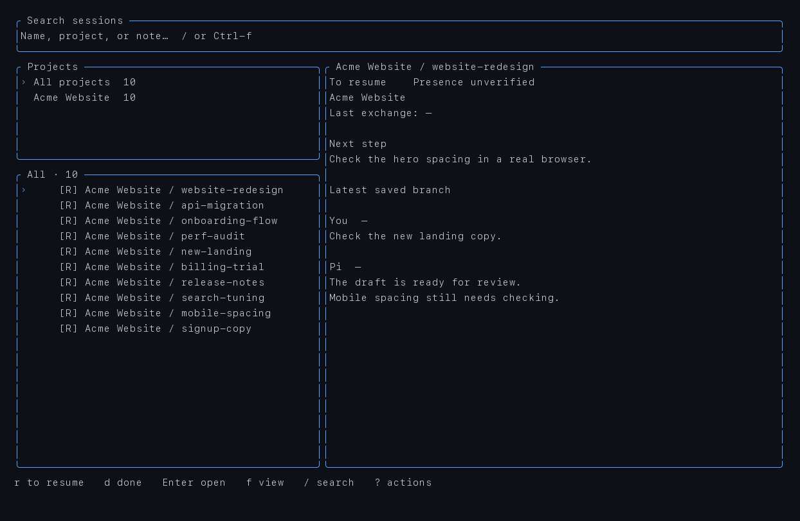

# agent-monitor

[](LICENSE)
[](https://www.rust-lang.org/)
[](#)
[](#checks)

A terminal session explorer for coding agents. Browse past conversations
by project, preview the full exchange, and resume exactly where work
stopped — from the TUI or from scripts.



```sh
cargo build --release --locked
./target/release/agent-monitor
```

## Overview

`agent-monitor` indexes locally stored agent sessions (Pi JSONL v3) into a
private SQLite catalog and presents them in a three-panel terminal UI:
projects, sessions, and conversation preview. It also detects live agent
processes in tmux, so `Enter` either jumps to the running pane or reopens
the same transcript in a fresh window.

Supported agents are recognized by process: Pi (primary, with transcript
indexing and an optional presence extension), Claude, Codex, and Opencode
(presence only).

## Features

- **Automatic discovery.** Projects, names, and history are derived from
  stored session files. No manual registration and no extension required.
- **Resume-oriented workflow.** Sessions carry an explicit state — history,
  to-resume, or done — plus a short next-step note. States are user
  decisions; activity or idleness never changes them implicitly.
- **Live pane awareness.** Verified extension records (`[O]`) and passive
  title/folder hints (`[~]`) distinguish proven openings from guesses.
  Duplicate names are never associated arbitrarily.
- **Safe resume.** Reopening a closed session uses exact argv
  (`<agent> --session <file>`) in the project directory, preferring a new
  tmux window, otherwise a new detached session. Verified or probable
  openings block accidental duplicates.
- **Readable previews.** Paginated newest-first pages, branch selection,
  optional tool output. Reasoning traces and images stay hidden.
- **Search everywhere.** The top bar filters the active panel: projects,
  session names/notes, or the current conversation text.
- **Scriptable.** The full workflow (list, show, resume, annotate, undo,
  sync) is available as CLI commands with JSON output.

## Quick start

Build and launch the explorer:

```sh
cargo build --release --locked
./target/release/agent-monitor
```

It opens on **All** sessions. Type `/` to search, `Enter` to open a
project or jump to a session, `f` to switch views (All, To resume, Open,
Done), `?` for the contextual action menu.

Jump directly to one project:

```sh
./target/release/agent-monitor pick --project acme-website
```

## Screenshot

The image above is generated from synthetic data by
`scripts/screenshot.py` (via `cargo run --example layout`), so no real
session content ever appears in the repository. Regenerate it with:

```sh
python3 scripts/screenshot.py
```

## Key bindings

| Key | Action |
|---|---|
| `j/k`, arrows | Move or scroll |
| `h/l`, `Tab` | Switch panel |
| `Enter` | Open the pane, or offer to resume |
| `f` / `p` | Change view / pick project |
| `r` / `d` | Mark to resume / done |
| `n` / `u` | Next-step note / undo |
| `/`, `Ctrl-f`, click the bar | Search projects, names, notes, or text |
| `z` | Expand the conversation |
| `[` / `]` | Older / newer pages |
| `b` / `t` | Branches / tool output |
| `o` / `i` | Browse open panes / file info |
| `gg`, `G`, `Ctrl-d/u` | Jump to ends, half pages |
| `Esc`, `?`, `q` | Back, actions, quit (monitor only) |

## CLI reference

```sh
agent-monitor sessions --all --project acme-website
agent-monitor sessions --open --json
agent-monitor show <id>
agent-monitor done <id>
agent-monitor reopen <id>
agent-monitor note <id> 'Check the timeout'
agent-monitor undo <id>
agent-monitor open <id> [--resume]
agent-monitor sync
agent-monitor sources list
agent-monitor sources add /path/to/sessions
agent-monitor integration pi status
```

`<id>` accepts the agent session id or the catalog id shown by
`sessions --json`; ambiguous ids are rejected. `open` jumps to a verified
opening when one exists; otherwise it asks for confirmation (or `--resume`
in scripts) and revalidates identity, folder, and presence before launch.

## Optional presence extension

Pane matching works without installation (exact title + folder ⇒ probable
`[~]`). For proven identity (`[O]`), including across in-process session
switches, install the bundled Pi extension:

```sh
./target/release/agent-monitor integration pi install
```

Then run `/reload` in each already-open Pi session; new sessions load it
automatically. The monitor never sends input to agent sessions on your
behalf.

## Data and privacy

- Transcripts are read-only; the JSONL files remain the source of truth.
- State lives in `~/.local/state/agent-monitor/sessions.db` (directory
  0700, database 0600). Override with `AGENT_MONITOR_HOME` or `--data-dir`.
- No network access, no telemetry, no credentials read.
- Display strings are sanitized (ANSI/control/bidi sequences stripped).

## Limits

- Transcript format: Pi JSONL v3. Older formats are reported, not migrated.
- Caps: 512 MiB files, 8 MiB lines, 100k preview entries. Oversized
  content is reported, not loaded.
- Unsaved sessions (`--no-session`, or before the first message) appear
  only while running and cannot be resumed from the catalog.
- Custom session directories are discovered via standard locations and
  `.pi/settings.json`; undeclared paths can be added with `sources add`.

## Development

```sh
cargo fmt --check
cargo test --locked
cargo clippy --all-targets --locked -- -D warnings
cargo build --locked
bun test integrations/pi
python3 scripts/smoke.py
cargo run --release --example latency
python3 scripts/latency.py                 # after the release build
cargo run --example layout                # synthetic preview
```

Tests use temporary directories and stub executables; no real agent
process is ever started. Performance figures are local measurements.

## License

MIT. See [LICENSE](LICENSE).
